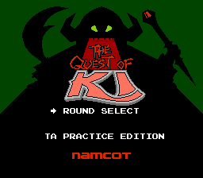
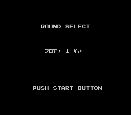
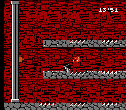
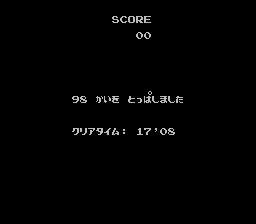

# Ki no Bouken (The Quest of Ki): Time Attack Practice Edition  
This is a practice rom hack for Kai no Bouken (The Quest of Ki) speedrun.  
   
   
  
## How to play
Patch "QoK_TimeAttack_v1.0.ips" to a vanilla Ki no Bouken (The Quest of Ki) rom.  

## Features  
- Round Select (debug mode) is enabled.  
- Timer counts up instead of count-down and the finish time will be shown on the result screen.  
\* first number is seconds (0-255), second number is frames (0-60).  
\* no time up death due to this change, however original timer still runs in game (timer's color changes when time is up).  
- During pause, pressing SELECT will restart the current floor.  
- During pause, holding SELECT will send back to Round Select.  
- During Ki's death motion, pressing START/SELECT will restart the current floor quickly.  
- In the screen before starting the floor, pressing START/SELECT will start the floor quickly.
- Automatically skips the namco logo, Ishtar screen, and Quox screen.  
- Infinite lives  
  
## Patch Download
https://github.com/becored/QoK_TA/releases/tag/v1.0  
Download "QoK_TA_Practice_Edition_ver1.0.zip" from Assets.  
  
## Credits  
- Lichtwirbelwind for motivation of this hack  
- Puresabe for macro ASM  
